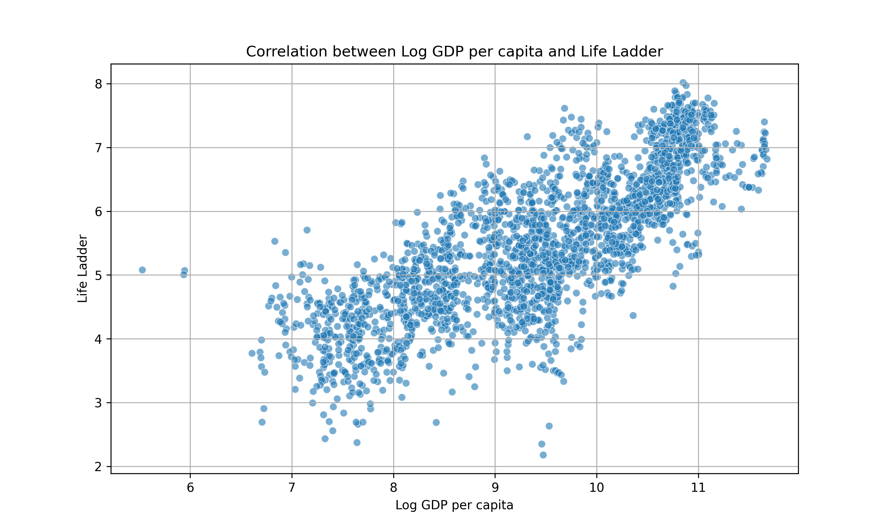
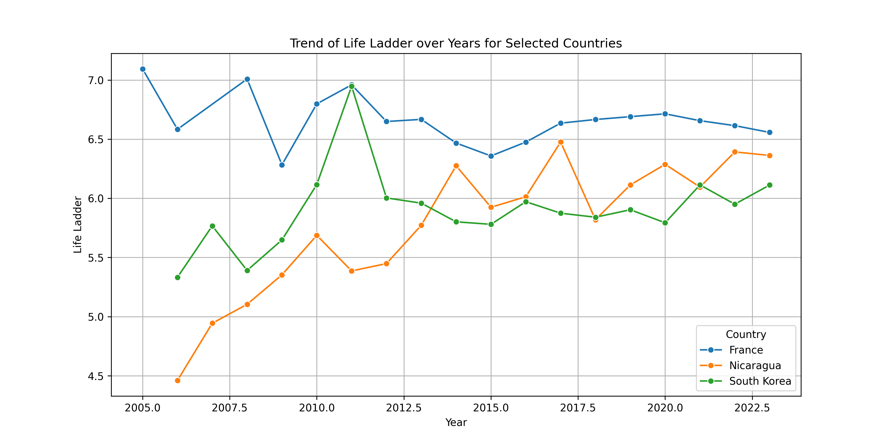
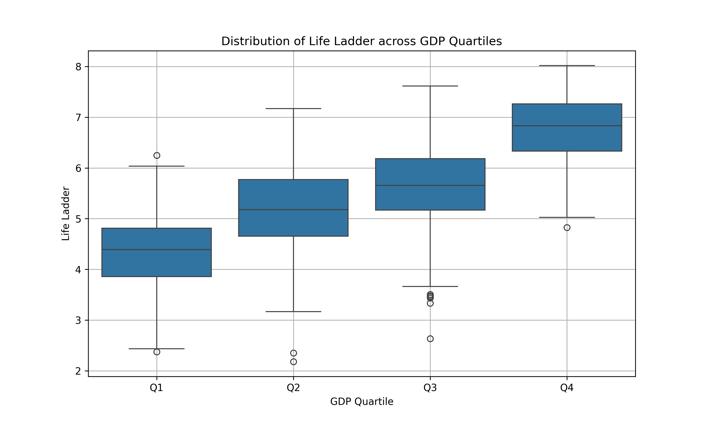

# README.md

## Unlocking the Secrets of Happiness: A Journey Through Life Satisfaction and Economic Prosperity

### Introduction

In a world that moves swiftly and relentlessly, the pursuit of happiness remains one of humanity's most profound quests. This dataset, a treasure trove of insights, captures the essence of life satisfaction across various nations and temporal landscapes, intertwining the threads of economic capability with the delicate fabric of wellbeing. With 2,363 observations and 11 meticulously curated attributes, this analysis invites you to embark on a journey through the realms of Life Ladder, GDP, social support, and more, offering not just numbers, but stories that resonate with the human experience.

### The Dataset: A Glimpse Into Human Existence

At the heart of our exploration lies a dataset that elegantly contrasts the lives of individuals from diverse countries, spanning a timeline from 2005 to 2023. 

- **Country Name**: Each entry is a life, a culture, a story— from the bustling streets of **South Korea** to the tranquil landscapes of **Nicaragua**.
- **Year**: Capturing the evolution of happiness over time, this column serves as a historical timeline, marking significant events that shaped societies.
- **Life Ladder**: This pivotal metric is the very embodiment of human satisfaction, with values ranging from a low of 1.281 to a high of 8.019, reflecting the spectrum of human experience.
- **Log GDP per Capita**: Here lies the economic heartbeat, revealing how wealth translates into wellbeing. With a mean value of 9.399, this measure relates directly to how nations provide for their citizens.
- **Social Support, Freedom, Generosity, and Perceptions of Corruption**: These are the intricate threads that weave the social fabric, influencing happiness in ways that are as complex as they are beautiful.

### Data Preprocessing: A Transformation of Raw Insights

Before diving into analysis, the data underwent meticulous preprocessing. Missing values were identified, revealing gaps that could obscure our understanding. For instance, the **Log GDP per capita** column had 28 missing entries, while **Healthy life expectancy at birth** had 63. Each missing value represented a voice unheard, a story untold.

Following this, we categorized GDP into quartiles, transforming continuous data into digestible segments that reveal profound insights about life satisfaction across economic strata. This transformation was not merely procedural; it was akin to uncovering a hidden dimension, allowing us to visualize how wealth influences happiness in tangible ways.

### The Analysis: Illuminating Insights

With the dataset refined, we ventured into analysis, producing visualizations that serve as windows into new dimensions of understanding.

1. **Correlation Analysis**: Our scatter plot of **Log GDP per Capita** vs. **Life Ladder** beautifully demonstrates the positive correlation between wealth and happiness. Each dot represents a country's journey, and the upward trend serves as a poignant reminder of the power of economic stability in fostering happiness. As we gaze upon this chart, we are reminded of the universal truth: where resources flourish, joy often follows.

   

2. **Trend Analysis**: The line plot illustrating the **Life Ladder** trends for selected countries—**France**, **South Korea**, and **Nicaragua**—is a testament to resilience and change. Each line tells a story, reflecting the unique societal shifts and challenges faced by these nations. For instance, South Korea’s steady ascent in life satisfaction mirrors its economic rise, while Nicaragua’s fluctuations evoke a narrative of struggle and hope.

   

3. **Box Plot Analysis**: Our box plot revealing the distribution of **Life Ladder** scores across GDP quartiles unveils a striking truth: as nations rise through the economic ranks, their citizens experience an uplifting surge in life satisfaction. The quartiles act as beacons, illuminating the disparities and triumphs in the human quest for happiness.

   

### Profound Revelations: Statistics That Speak

As we delve deeper, the statistics reveal stunning insights:

- The average **Life Ladder** score of **5.48** invites us to ponder: Is this a reflection of contentment or a call to strive for something greater?
- A **Log GDP per Capita** mean of **9.40** beckons us to reflect on the disparities in wealth distribution—how many lives are left unfulfilled in the shadows of economic prosperity?
- The average **Social Support** score of **0.81** leads us to consider the importance of community—how vital is connection in our collective happiness?

### A Call to Reflect

As we conclude this analysis, we urge you to reflect on the stories inherent in the data. Each number is not merely a statistic; it embodies a life, a struggle, a triumph. 

Consider the individuals behind these figures—the single mother in **Nicaragua**, striving for a better life for her children, the entrepreneur in **South Korea**, innovating against the odds, and the retirees in **France**, enjoying the fruits of their labor. Their stories intertwine with the data, creating a rich tapestry of human experience that transcends borders and cultures.

### Code Snippet: The Power Behind the Visualization

Here is the final code snippet that facilitated our exploration and visualization of this enlightening dataset:

```python
import pandas as pd
import matplotlib.pyplot as plt
import seaborn as sns

# Assuming df is already loaded

# 1. Correlation Analysis: Scatter Plot
plt.figure(figsize=(10, 6))
sns.scatterplot(data=df, x='Log GDP per capita', y='Life Ladder', alpha=0.6)
plt.title('Correlation between Log GDP per capita and Life Ladder')
plt.xlabel('Log GDP per capita')
plt.ylabel('Life Ladder')
plt.grid()
plt.savefig('correlation_gdp_life_ladder.png', dpi=300)
plt.close()

# 2. Trend Analysis: Line Plot for selected countries
selected_countries = ['France', 'South Korea', 'Nicaragua']
df_filtered = df[df['Country name'].isin(selected_countries)]

plt.figure(figsize=(12, 6))
sns.lineplot(data=df_filtered, x='year', y='Life Ladder', hue='Country name', marker='o')
plt.title('Trend of Life Ladder over Years for Selected Countries')
plt.xlabel('Year')
plt.ylabel('Life Ladder')
plt.legend(title='Country')
plt.grid()
plt.savefig('trend_life_ladder_selected_countries.png', dpi=300)
plt.close()

# 3. Box Plot: Life Ladder across GDP quartiles
# Create GDP quartiles
df['GDP Quartile'] = pd.qcut(df['Log GDP per capita'], 4, labels=['Q1', 'Q2', 'Q3', 'Q4'])

plt.figure(figsize=(10, 6))
sns.boxplot(data=df, x='GDP Quartile', y='Life Ladder')
plt.title('Distribution of Life Ladder across GDP Quartiles')
plt.xlabel('GDP Quartile')
plt.ylabel('Life Ladder')
plt.grid()
plt.savefig('boxplot_life_ladder_gdp_quartiles.png', dpi=300)
plt.close()
```

### Conclusion

In the end, this analysis serves as a reminder that behind every data point lies a story, waiting to be told. It invites us to reflect on our own lives and the lives of others, urging us to seek connections, foster understanding, and ultimately, pursue the happiness that binds us all. Let us carry these revelations with us, as we continue to explore the intricate dance between life satisfaction and the world around us.