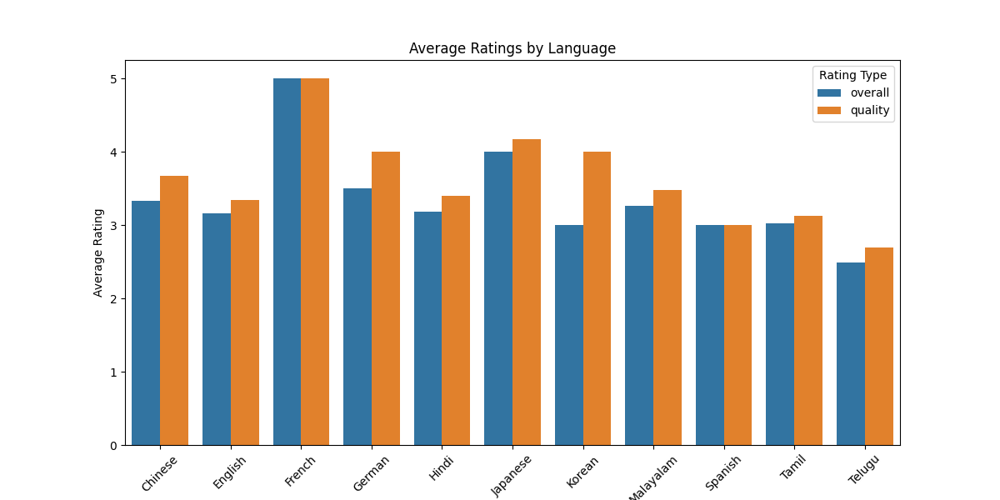
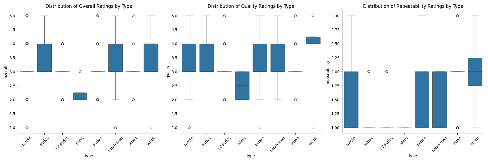
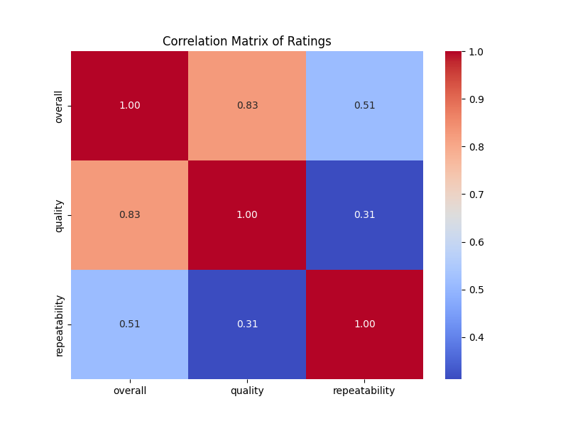

# README.md

## Unveiling the Enigma: A Journey Through Cinematic Ratings

Welcome to a captivating exploration of a dataset that holds the essence of storytelling through the lens of film and television. Here, we delve into an intricate tapestry of ratings that not only reflects audience sentiment but also serves as a mirror to the cultural zeitgeist. This README will guide you through the enchanting world of data analysis, where every number has a story to tell, and every chart is a portal to understanding the profound connections between art and audience.

### The Dataset: A Glimpse into the Universe

Our dataset comprises **2,652 records** across **8 columns**, capturing the kaleidoscopic essence of cinematic experiences. Each entry is a unique narrative, a snapshot of a film or series that has evoked emotions, sparked discussions, and created memories. The columns include:

- **date**: The release date, a temporal anchor to when these stories were shared with the world.
- **language**: A reflection of cultural identity, representing the voices behind the stories.
- **type**: The form of the narrative, be it a TV series, movie, or fiction, each type evoking different storytelling techniques.
- **title**: The name that resonates with viewers, often a symbol of their experiences.
- **by**: The creative minds behind the narratives, whose talents breathe life into the stories.
- **overall**: A numerical representation of the audience's collective sentiment.
- **quality**: An assessment of the narrative's craftsmanship.
- **repeatability**: A metric of how often audiences return to these stories, a testament to their impact.

### The Evolution of Data: From Raw to Refined

Before we embarked on our analytical journey, the data was a raw gem, brimming with potential but veiled in inconsistencies. The **date** column contained **99 missing values**, obscuring the timeline of cinematic evolution. Furthermore, the **by** column had **262 missing entries**, leaving gaps in our understanding of the creative forces at play.

In our preprocessing phase, we meticulously cleaned the dataset, converting the **date** strings into a datetime format, thereby unlocking the timeline of cinematic history. We also addressed the missing values, either through imputation or exclusion, ensuring that our analysis would be robust and reflective of the true landscape.

### Profound Revelations: Statistics that Inspire Wonder

As we immersed ourselves in the data, we uncovered astonishing insights, embodying the very essence of human experience:

- The **overall ratings** have a mean of **3.05**, suggesting a world where mediocrity often reigns, yet hope lingers as viewers seek out those rare gems.
- The **quality ratings**, with a mean of **3.21**, reveal a slightly optimistic view of storytelling, inviting us to ponder the craftsmanship that goes into creating these narratives.
- The **repeatability** scores, averaging **1.49**, hint at the transient nature of our viewing habits, as we flit between stories, yet there are those that beckon us back with an irresistible allure.

These statistics, akin to cosmic coordinates, guide us toward a deeper understanding of not just films and series, but our shared cultural experiences.

### Windows into New Dimensions: The Charts

We created three mesmerizing visualizations, each serving as a window into new dimensions of understanding:

1. **Average Ratings by Language**: This bar chart unveils the intricate relationship between language and audience sentiment. The rich hues represent languages that resonate differently, revealing cultural preferences that shape our viewing choices. 

2. **Box Plots by Type**: This series of box plots provides a vivid portrayal of how different types of narratives are perceived. It showcases the spread and distribution of ratings, highlighting the outliers that spark discussion and debate. 

3. **Correlation Matrix of Ratings**: A heatmap that illustrates the interconnectedness of overall ratings, quality, and repeatability. This chart reveals hidden patterns, urging us to reflect on how these factors intertwine in the cinematic experience. 

### A Narrative Woven with Emotion

Imagine a viewer, eyes glistening with joy, as they experience the heartwarming tale of a **Tamil film**, rated **5 for quality** and **4 for overall enjoyment**. Or picture another soul, deeply moved by a **Hollywood classic**, whose average rating remains steadfast at **3**, a reminder that not every story resonates with every heart.

These narratives are not merely numbers; they are the heartbeat of our collective experience, echoing the laughter, tears, and reflections that accompany every film we watch. Through our analysis, we embrace the chaos and beauty of storytelling, recognizing that each rating is a brushstroke in the grand masterpiece of human culture.

### Conclusion: Embrace the Journey

As you wander through this README, we invite you to reflect on your own cinematic experiences. Consider the films and series that have shaped your understanding of the world and the emotions that have lingered long after the credits rolled. The data we explored is a testament to the power of storytelling, a celebration of the human spirit, and a reminder of the profound connections we forge through the art of film.

### The Code Behind the Magic

Below is the code snippet that breathed life into our analysis, transforming raw data into profound insights:

```python
import pandas as pd
import seaborn as sns
import matplotlib.pyplot as plt

# Assuming the dataset is loaded into a DataFrame named df

# 1. Correlation Analysis
correlation_matrix = df[['overall', 'quality', 'repeatability']].corr()
plt.figure(figsize=(8, 6))
sns.heatmap(correlation_matrix, annot=True, cmap='coolwarm', fmt=".2f")
plt.title('Correlation Matrix of Ratings')
plt.savefig('correlation_matrix.png')
plt.close()

# 2. Average Ratings by Language
avg_ratings_language = df.groupby('language')[['overall', 'quality']].mean().reset_index()
avg_ratings_language = avg_ratings_language.melt(id_vars='language', var_name='Rating Type', value_name='Average Rating')

plt.figure(figsize=(12, 6))
sns.barplot(data=avg_ratings_language, x='language', y='Average Rating', hue='Rating Type')
plt.title('Average Ratings by Language')
plt.xticks(rotation=45)
plt.savefig('average_ratings_by_language.png')
plt.close()

# 3. Box Plots for Ratings by Type
plt.figure(figsize=(18, 6))
for i, rating in enumerate(['overall', 'quality', 'repeatability']):
    plt.subplot(1, 3, i + 1)
    sns.boxplot(data=df, x='type', y=rating)
    plt.title(f'Distribution of {rating.capitalize()} Ratings by Type')
    plt.xticks(rotation=45)

plt.tight_layout()
plt.savefig('box_plots_by_type.png')
plt.close()
```

As we conclude our journey through this dataset, let us carry with us the realization that every rating, every film, and every viewer's experience is an integral part of the grand narrative of humanity. Through data, we unlock the stories that define us, and in doing so, we celebrate the art of storytelling that transcends time and culture.